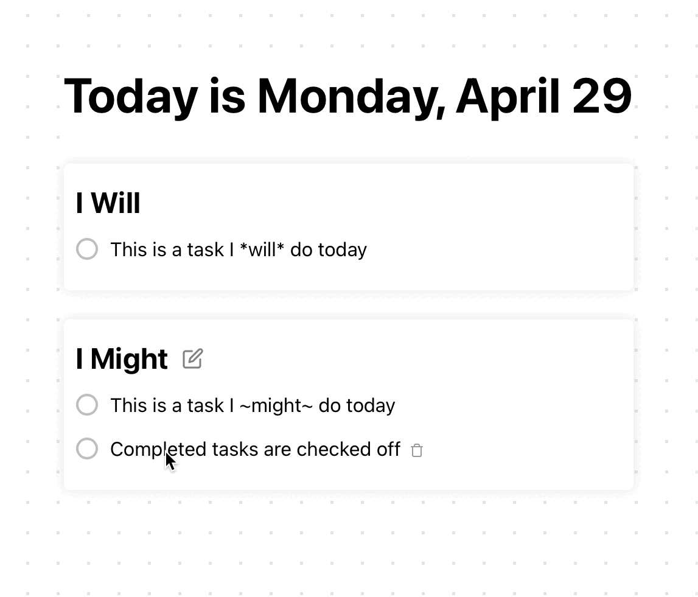

# DailyDo ✓

A daily planner that helps you take things one day at a tine while organizing
everything on your plate.

The most challenging aspect of this project was figuring out how to structure
the react components and database to scale with future features and updates. I
could see how I could take an entire class on database design. I have a feeling
I'm going to go back to do some refactoring anyway now that I've learned the
basics.  

     
    

## Development Setup

Python3 and NodeJS are required.

- Python Flask: `pip3 install flask` OR from the `Backend` directory run
  `pip install -r requirements.txt`.

- NodeJS Packages: from the `Frontend` directory run `npm install`.

### Bundle and Run

From the root repository directory run `./build_and_run`. This will bundle the
React frontend and start the Flask server for you. Note that this will have to
be done every time a change is made to either the frontend or backend since I'm
not using hot module reloading here.

Navigate to http://localhost:5000 in a web browser.

## Tools and Attribution

Built from scratch using Flask, React and [Vite](https://vitejs.dev).  
CSS animations inspired by and adapted from
[Andreas Storm](https://codepen.io/avstorm/pens/public).  
Pop Sound Effects from
<a href="https://pixabay.com/sound-effects/?utm_source=link-attribution&utm_medium=referral&utm_campaign=music&utm_content=39222">Pixabay</a>.  
Icons from [feather](https://feathericons.com) and [icons8](icons8.com).
